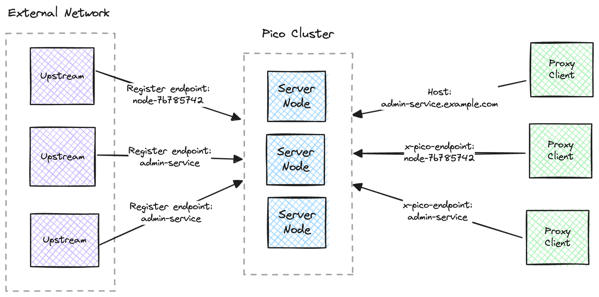

# Pico 

> :warning: Pico is currently only a proof of concept so is not yet suitable
for production.

Pico is a reverse proxy that allows you to expose a service that isn't publicly
routable (known as tunnelling). Unlike other open-source tunelling solutions,
Pico is designed to serve production traffic.

Upstream services register a listener with Pico via an outbound-only
connection. Downstream clients may then send HTTP(S) requests to Pico which
will be routed to an upstream listener.

Listeners are identified by an endpoint ID. Incoming HTTP requests include the
endpoint ID to route to in either the `Host` header or an `x-pico-endpoint`
header, then Pico load balances requests among registered listeners with that
endpoint ID.

## Contents

- [Design Goals](#design-goals)
- [Components](#components)
- [Getting Started](#getting-started)
- [Docs](#docs)
- [Limitations](#limitations)

## Design Goals

### Production Traffic
Unlike most open-source tunnelling solutions that are built for testing and
development (such as sharing a demo running on your local machine), Pico is
built to serve production traffic. Such as it could be used to access a
customer network in a bring your own cloud (BYOC) service.

Pico supports running the server as a cluster of Pico nodes, meaning Pico is
fault tolerant and scales horizontally.

### Hosting
Pico is designed to be simple to host, particularly in Kubernetes. Therefore
Pico may be hosted behind a HTTP load balancer or
[Kubernetes Gateway](https://kubernetes.io/docs/concepts/services-networking/gateway/).

The downside of this approach is it means Pico only supports HTTP. Pico
also uses WebSockets internally to communicate with upstream listeners, which
are typically supported by HTTP load balancers.

### Dynamic Endpoints
Upstream listeners may register any endpoint ID dynamically at runtime, without
any static configuration. When multiple listeners register with the same
endpoint ID, Pico will load balance requests among those listeners.

## Components

### Server
The Pico server is responsible for proxying requests from downstream clients to
registered upstream listeners.

Upstreams register one or more listeners with the server via an outbound-only
connection. Each listener is identified by an endpoint ID.

Pico may be hosted as a cluster of servers for fault tolerance and scalability.

The server has three ports:
* Proxy port (`8000`): Listens for requests from downstream clients which
are forwarded to upstream listeners
* Upstream port (`8001`): Listens for connections from upstream listeners
* Admin port (`8002`): Listeners for admin requests to inspect the server
status

The proxy and upstream ports are separate since they downstream clients and
upstream listeners will typically be on different networks. Such as you may
expose the upstream port to the Internet but only allow requests to the proxy
port from nodes in the same network.

#### Routing
Incoming HTTP requests include the endpoint ID to route to in either the `Host`
header or an `x-pico-endpoint` header, then Pico load balances requests among
registered listeners with that endpoint ID.

When the `Host` header is used, the server must be configured with a wildcard
DNS entry, where the bottom-level domain contains the endpoint ID. Such as if
you host Pico at `pico.example.com`, you can then send requests to
`<endpoint ID>.pico.example.com`.

Alternatively if an `x-pico-endpoint` header is included, it takes precedence
over the `Host` header, such as you could send a request to `pico.example.com`
with header `x-pico-endpoint: <endpoint ID>`. This means you don't have to
setup a wildcard DNS entry, though it does mean Pico isn't transparent to the
client.

### Agent
The Pico agent is a CLI that runs alongside your upstream service that
registers one or more listeners.

The agent will connect to a Pico server, register the configured listeners,
then forwards incoming requests to your upstream service.

Such as if you have a service running at `localhost:3000`, you can register
endpoint `my-endpoint` that forwards requests to that local service.

## Getting Started
This section describes how to run both the Pico server and agent locally. In
production you'd host the server remotely as a cluster, though this is still
useful to demo Pico.

Start by either downloading the `pico` binary from the releases page, or to
build Pico directly you can clone the repo and run `make pico` (which requires
Go 1.21 or later).

### Server
Start the server with `pico server`, which will listen for proxy requests at
`localhost:8000` and upstream connections at `localhost:8001` by default.

See `pico server -h` for the available configuration options.

### Agent
Next start a service you would like to route requests to, such as
`python3 -m http.server 3000` to start a simple HTTP file server listening on
port `3000`.

Next you can start Pico agent with
`pico agent --listeners my-endpoint-123/localhost:3000` which registers a
listener with endpoint ID `my-endpoint-123` and forwards requests to
`localhost:3000`.

See `pico agent -h` for the available configuration options.

### Send a Request
As described above, Pico routes requests using the endpoint ID in either the
`Host` header or `x-pico-endpoint` (where `x-pico-endpoint` takes precedence).

Since using a `Host` header requires setting up a wildcard DNS entry, the
simplest option when running locally is to set the `x-pico-endpoint` header.

Such as to send a HTTP request to your service at `localhost:3000` via endpoint
`my-endpoint-123`, use
`curl -H "x-pico-endpoint: my-endpoint-123" http://localhost:8000`.

You can also inspect the server status using `pico status`. Such as to view the
endpoints registered to this server use `pico status proxy endpoints`.

## Docs
See [docs](./docs) for details on deploying and managing Pico, plus details on
the Pico architecture:
- Deploy
  - [Observability](./docs/deploy/observability.md)
